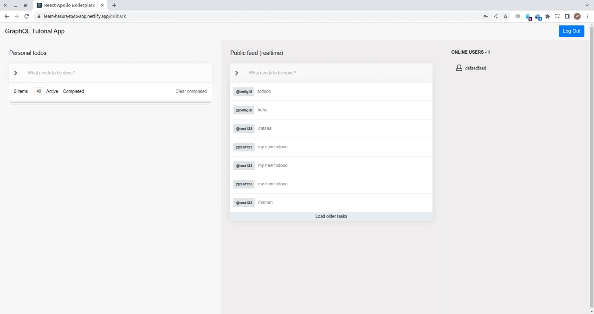

# 🎣 React apollo Hooks
What we'll be building: https://learn-hasura-todo-app.netlify.com/

## Tutorial
--------
- [React](https://hasura.io/learn/graphql/react/introduction)
- [Hasura GraphQL Endpoint](https://hasura.io/learn/graphql)

## Tech stack
----------
- Frontend
    - React v16.8
    - Apollo Boost v0.4.3

- Backend
    - Hasura GraphQL Engine

## Run the React app
-----------------
`npm run start`

or

`yarn start`